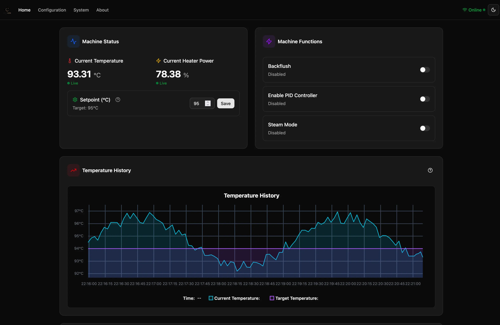
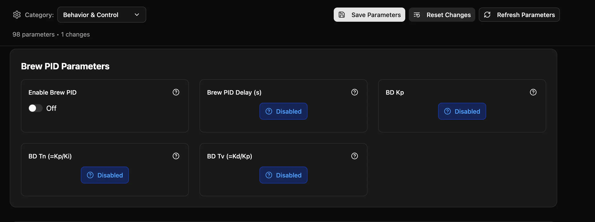
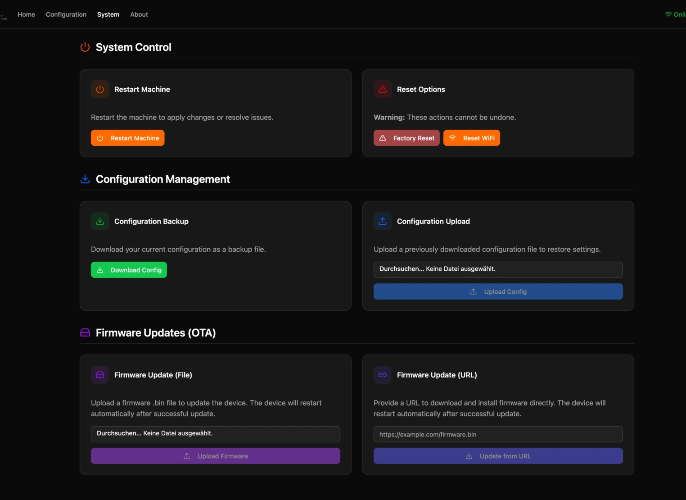

# Forked CleverCoffee code

This is fork from [CleverCoffee](https://github.com/rancilio-pid/clevercoffee) which includes some internal refactorings and new features for testing and ideas.

`esptool.py --chip esp32 merge_bin -o merged-flash.bin --flash_mode dio --flash_size 4MB 0x1000 bootloader.bin 0x8000 partitions.bin 0x10000 firmware.bin`

## Changes made

- Internal refactoring of the configuration and how data is stored
- Internal refactoring to kind of centralize the global variables which are used across the code
  - Easier to get used to the code to see what types of data are shared across files. Still not the best but maybe some starting point. Probably best this should be located in some kind of Singleton so we get some power to test things without having to actually always flash the whole device
- Persistence of configurations across updates and flashes including new UI updates
  - Data is stored in the so called `NVS` which for ESP32 are just dedicated flash block and not the default FileSystem range
  - https://docs.espressif.com/projects/esp-idf/en/stable/esp32/api-reference/storage/nvs_flash.html
- Brand new UI based on react, precompiled and fast
- Hostname configuration during setup of the ESP for direct access with new DNS name
- OTA support in the web app: update by uploading a binary or providing a link to the binary

## New Frontend / UI

- Dark mode support
- New HomePage

- Conditional parameter selection with change detection

- System Page

## How to try out?

Like before and described in the documentation you can just build the binaries and flash on your device.
Easy going.
