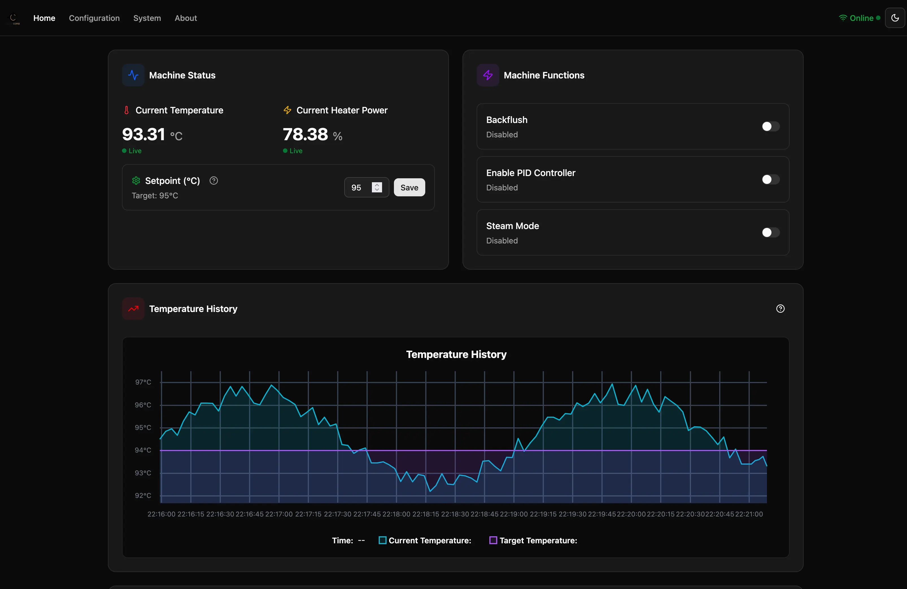
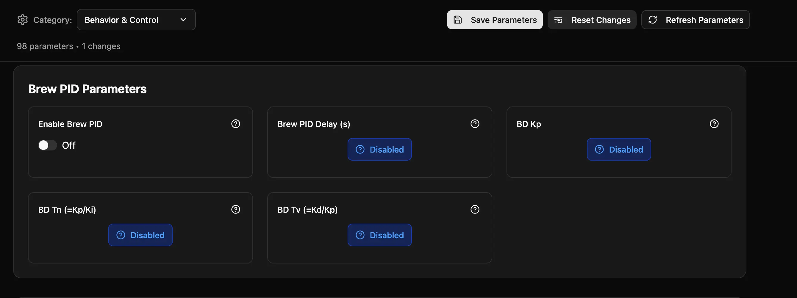
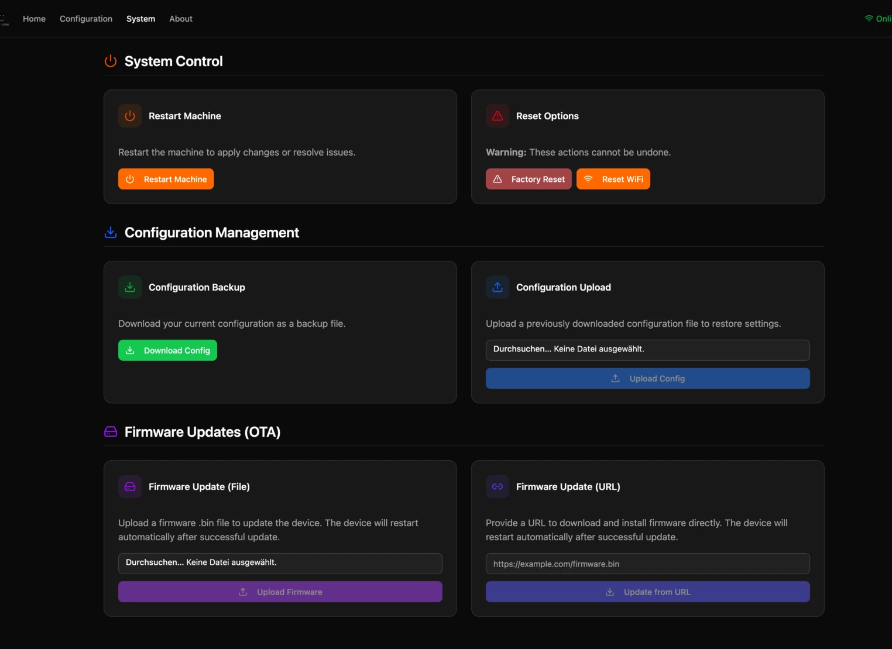

# Forked CleverCoffee code

This is fork from [CleverCoffee](https://github.com/rancilio-pid/clevercoffee) which includes some internal refactorings and new features for testing and ideas.

## Which firmware do you want?

This fork currently carries **two firmwares**, and picking the wrong one wastes
an afternoon.

| | Rust (this branch's work) | C++ (PlatformIO) |
| --- | --- | --- |
| Where | `crates/cc-*`, built by `justfile` | `src/`, `include/`, `test/`, built by `platformio.ini` |
| Status | the port; not yet released | what `release.yml` publishes today |
| Build | `just setup` once, then `just build-esp32` | `pio run -e esp32_usb` |
| Gate | `just check` (no hardware) | `pio test -e native_test` |
| Docs | [docs/rust-migration/README.md](docs/rust-migration/README.md) | [REPOSITORY_SUMMARY.md](REPOSITORY_SUMMARY.md) |

**The C++ tree is the parity oracle.** It is not being deleted, it is not being
"cleaned up", and the Rust port's own test suite is measured against it. Every
deliberate divergence is recorded in
[intentional-diffs.md](docs/rust-migration/intentional-diffs.md) — start there
when a behaviour looks wrong.

### Building the Rust firmware

```sh
just setup        # mise tools + the Espressif Xtensa toolchain + the web UI
just doctor-host  # host checks only — needs no device toolchain
just check        # fmt, clippy, rustdoc, tests, parity — on stable, no hardware
just gate         # the above + device clippy, firmware build, size budget — on esp
```

Flashing needs a board, so it is never a default recipe:

```sh
just identify <port>     # ALWAYS first — confirm the chip before writing to it
just flash <port>
```

The device is an **ESP32-DevKitC V4 / ESP32-WROOM-32E** — the original ESP32,
Xtensa LX6. There is no S3, C3 or C6 in this project, and `channel = "esp"` in
`rust-toolchain.toml` is an Espressif **nightly fork** that rustup installs, not
something mise can provide. `just doctor` checks the device toolchain and
`just doctor-host` checks only what a host-only machine can assert.

Two toolchains, on purpose: `just check` (fmt, clippy, rustdoc, tests, parity)
runs on **stable**, because the crates it covers are plain `#![no_std]` Rust that
touches no Xtensa pin — which is also what makes the workspace's
`rust-version = "1.82"` claim verifiable. `just gate` and everything that builds
or flashes the firmware run on **`esp`**, the `rust-toolchain.toml` pin. Use
`just check` before you push; it needs no device toolchain and no hardware.

The manual checklist is [docs/integration-tests.md](docs/integration-tests.md).

What CI runs and what it costs: [docs/ci.md](docs/ci.md).

### Building the C++ firmware (the parity oracle)

```sh
pio run -e esp32_usb
pio test -e native_test
```

`esptool.py --chip esp32 merge_bin -o merged-flash.bin --flash_mode dio --flash_size 4MB 0x1000 bootloader.bin 0x8000 partitions.bin 0x10000 firmware.bin`

## Changes made

- Internal refactoring of the configuration and how data is stored
- Internal refactoring to kind of centralize the global variables which are used across the code
  - Easier to get used to the code to see what types of data are shared across files. Still not the best but maybe some starting point. Probably best this should be located in some kind of Singleton so we get some power to test things without having to actually always flash the whole device
- Persistence of configurations across updates and flashes including new UI updates
  - Data is stored in the so called `NVS` which for ESP32 are just dedicated flash block and not the default FileSystem range
  - https://docs.espressif.com/projects/esp-idf/en/stable/esp32/api-reference/storage/nvs_flash.html
- Brand new UI based on react, precompiled and fast
- Hostname configuration during setup of the ESP for direct access with new DNS name
- OTA support in the web app: update by uploading a binary or providing a link to the binary

## New Frontend / UI

- Dark mode support
- New HomePage

- Conditional parameter selection with change detection

- System Page


## How to try out?

Like before and described in the documentation you can just build the binaries and flash on your device.
Easy going.
