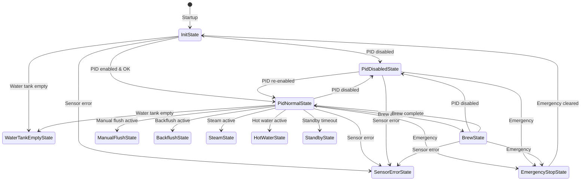

# CleverCoffee State Machine Diagram

```mermaid
stateDiagram-v2
    [*] --> InitState : Startup

    InitState --> WaterTankEmptyState : Water tank empty
    InitState --> SensorErrorState : Sensor error
    InitState --> PidDisabledState : PID disabled
    InitState --> PidNormalState : PID enabled & OK

    PidNormalState --> EmergencyStopState : Emergency
    PidNormalState --> BrewState : Brew active
    PidNormalState --> ManualFlushState : Manual flush active
    PidNormalState --> BackflushState : Backflush active
    PidNormalState --> SteamState : Steam active
    PidNormalState --> HotWaterState : Hot water active
    PidNormalState --> StandbyState : Standby timeout
    PidNormalState --> PidDisabledState : PID disabled
    PidNormalState --> WaterTankEmptyState : Water tank empty
    PidNormalState --> SensorErrorState : Sensor error

    PidDisabledState --> EmergencyStopState : Emergency
    PidDisabledState --> SensorErrorState : Sensor error
    PidDisabledState --> PidNormalState : PID re-enabled

    BrewState --> EmergencyStopState : Emergency
    BrewState --> PidDisabledState : PID disabled
    BrewState --> SensorErrorState : Sensor error
    BrewState --> PidNormalState : Brew complete

    EmergencyStopState --> InitState : Emergency cleared

    %% The following states have NO outgoing transitions in your code:
    %% StandbyState, ManualFlushState, BackflushState, SteamState, HotWaterState, WaterTankEmptyState, SensorErrorState

    %% They are shown as terminal states unless externally forced to transition.
```
