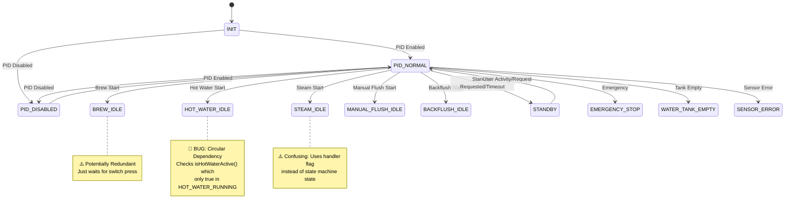
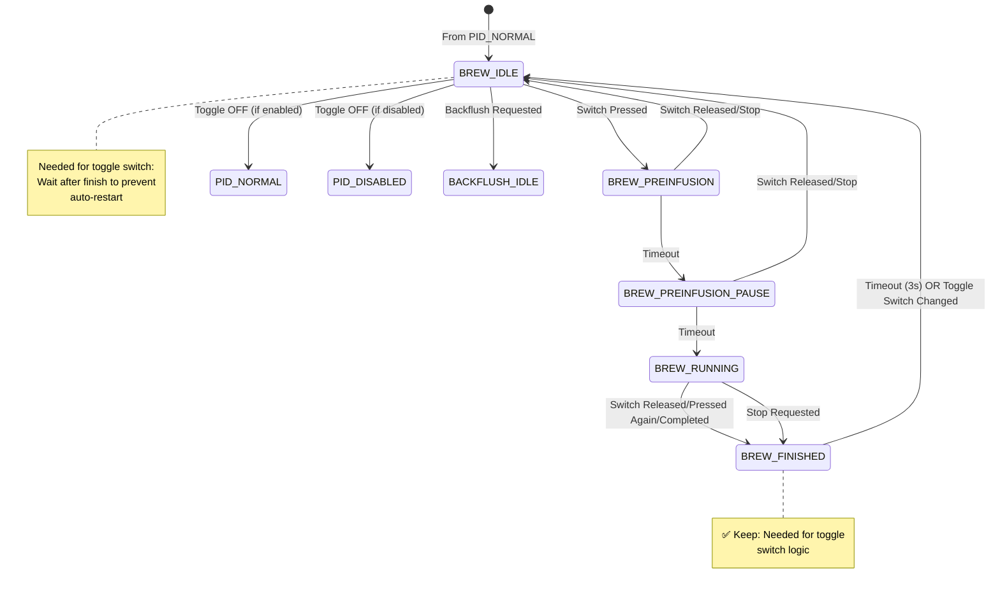
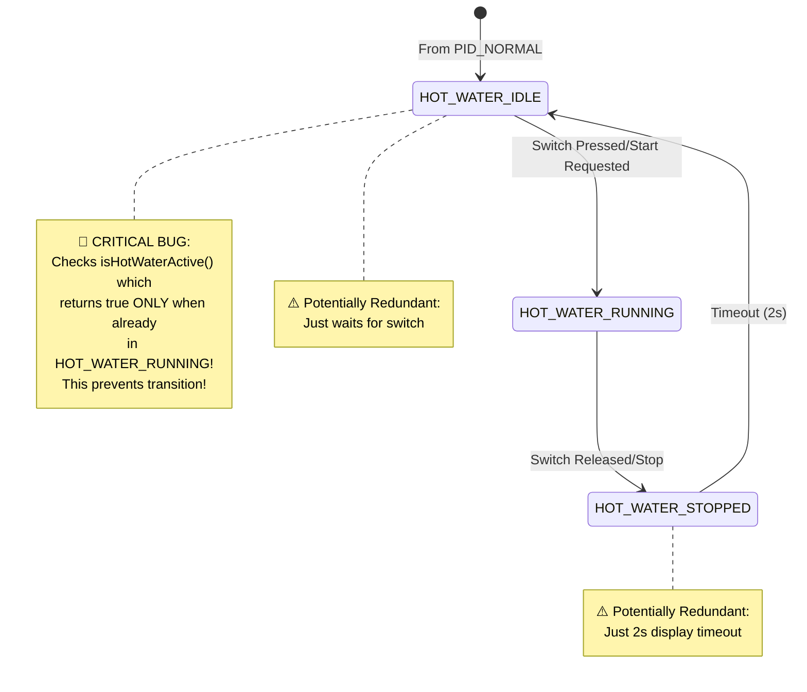
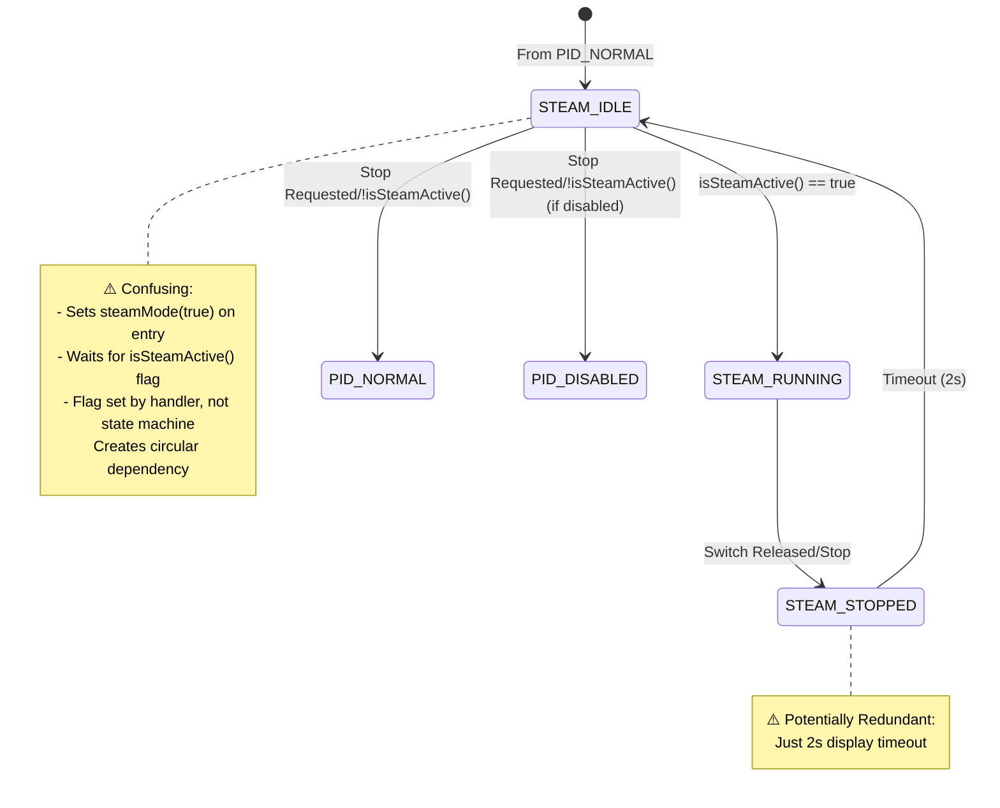
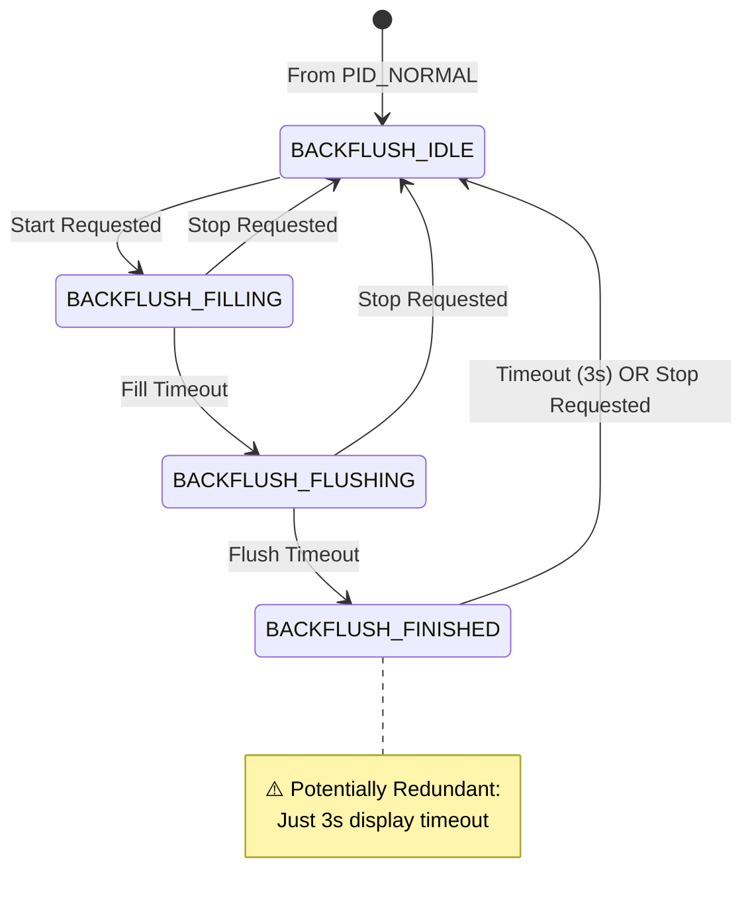
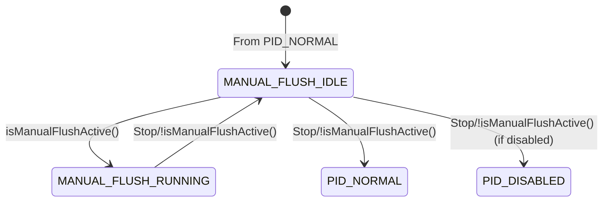
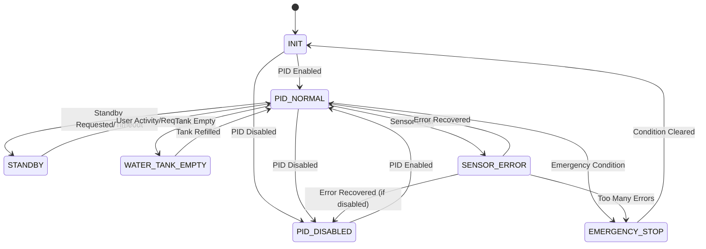
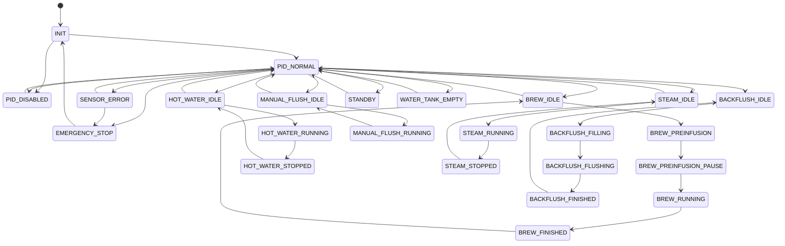
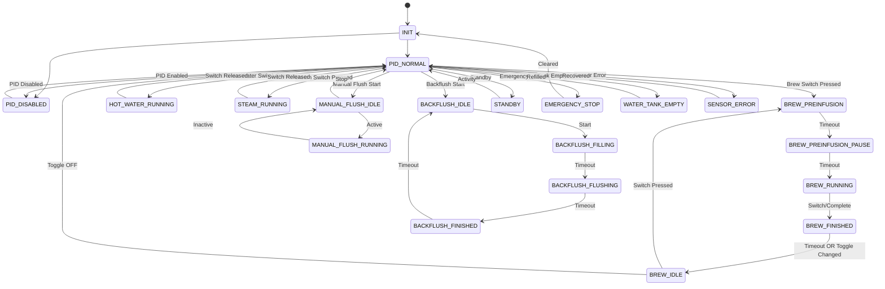

# State Machine Analysis

## State Machine Visualization

### Overview Diagram

### Brew State Flow

### Hot Water State Flow

### Steam State Flow

### Backflush State Flow

### Manual Flush State Flow

### System States Flow

### Complete State Diagram (Simplified)

## Current State Structure

### Total States: 25

**System States (4):**
- `INIT` (0) - System initialization
- `PID_NORMAL` (20) - Normal PID operation
- `PID_DISABLED` (90) - PID disabled
- `STANDBY` (95) - Power saving mode

**Brew States (5):**
- `BREW_IDLE` (30) - Waiting for brew start
- `BREW_PREINFUSION` (31) - Preinfusion phase
- `BREW_PREINFUSION_PAUSE` (32) - Blooming/pause phase
- `BREW_RUNNING` (33) - Active brewing
- `BREW_FINISHED` (34) - Brew complete (display + timeout)

**Hot Water States (3):**
- `HOT_WATER_IDLE` (40) - Waiting for hot water start
- `HOT_WATER_RUNNING` (41) - Dispensing hot water
- `HOT_WATER_STOPPED` (42) - Stopped (2s display timeout)

**Steam States (3):**
- `STEAM_IDLE` (50) - Steam mode activated, waiting
- `STEAM_RUNNING` (51) - Actively steaming
- `STEAM_STOPPED` (52) - Stopped (2s display timeout)

**Manual Flush States (2):**
- `MANUAL_FLUSH_IDLE` (35) - Manual flush mode activated
- `MANUAL_FLUSH_RUNNING` (36) - Flushing active

**Backflush States (4):**
- `BACKFLUSH_IDLE` (60) - Ready for backflush
- `BACKFLUSH_FILLING` (61) - Filling phase
- `BACKFLUSH_FLUSHING` (62) - Flushing phase
- `BACKFLUSH_FINISHED` (63) - Complete (3s display timeout)

**Error States (4):**
- `WATER_TANK_EMPTY` (70)
- `EMERGENCY_STOP` (80)
- `SENSOR_ERROR` (100)
- `EEPROM_ERROR` (110)

---

## Issues and Redundancies

### 🔴 **CRITICAL: Circular Logic Issues**

1. **HOT_WATER_IDLE → HOT_WATER_RUNNING**
   - `HOT_WATER_IDLE` checks `isHotWaterActive()` to transition
   - `isHotWaterActive()` returns `true` only if state is `HOT_WATER_RUNNING`
   - **BUG**: This creates a circular dependency - IDLE can never transition!
   - **Should check**: Switch state directly, not `isHotWaterActive()`

2. **STEAM_IDLE → STEAM_RUNNING**
   - `STEAM_IDLE` checks `!isSteamActive()` to exit
   - `isSteamActive()` returns `steamON_` flag (set by handler)
   - **Confusing**: State machine depends on handler flag, not state
   - **Should check**: Switch state or handler state directly

### 🟡 **Potentially Redundant States**

#### 1. **BREW_IDLE (30)**
- **Purpose**: Wait for brew switch press
- **Behavior**: Immediately transitions to `BREW_PREINFUSION` on switch press
- **Question**: Why not transition directly from `PID_NORMAL` to `BREW_PREINFUSION`?
- **Current flow**: `PID_NORMAL` → `BREW_IDLE` → `BREW_PREINFUSION`
- **Proposed**: `PID_NORMAL` → `BREW_PREINFUSION` (eliminate BREW_IDLE)
- **Exception**: Needed for toggle switch logic (waiting after finish)

#### 2. **HOT_WATER_IDLE (40)**
- **Purpose**: Wait for hot water switch press
- **Behavior**: Immediately transitions to `HOT_WATER_RUNNING` on switch press
- **Question**: Why not transition directly from `PID_NORMAL` to `HOT_WATER_RUNNING`?
- **Current flow**: `PID_NORMAL` → `HOT_WATER_IDLE` → `HOT_WATER_RUNNING`
- **Proposed**: `PID_NORMAL` → `HOT_WATER_RUNNING` (eliminate HOT_WATER_IDLE)

#### 3. **STEAM_IDLE (50)**
- **Purpose**: Activate steam mode, wait for steam to be active
- **Behavior**: Sets `steamMode(true)`, waits for `isSteamActive()` flag
- **Question**: Why separate IDLE? Could activate steam mode in RUNNING state
- **Current flow**: `PID_NORMAL` → `STEAM_IDLE` → `STEAM_RUNNING`
- **Note**: Steam mode activation might need separate state for setup

#### 4. **HOT_WATER_STOPPED (42)**
- **Purpose**: 2-second display timeout after stopping
- **Behavior**: Just waits 2 seconds, then goes to `HOT_WATER_IDLE`
- **Question**: Is this just for display? Could go directly back to PID
- **Current flow**: `HOT_WATER_RUNNING` → `HOT_WATER_STOPPED` → `HOT_WATER_IDLE` → `PID_NORMAL`
- **Proposed**: `HOT_WATER_RUNNING` → `PID_NORMAL` (eliminate STOPPED and IDLE)

#### 5. **STEAM_STOPPED (52)**
- **Purpose**: 2-second display timeout after stopping
- **Behavior**: Just waits 2 seconds, then goes to `STEAM_IDLE`
- **Question**: Is this just for display? Could go directly back to PID
- **Current flow**: `STEAM_RUNNING` → `STEAM_STOPPED` → `STEAM_IDLE` → `PID_NORMAL`
- **Proposed**: `STEAM_RUNNING` → `PID_NORMAL` (eliminate STOPPED, keep IDLE for mode activation)

#### 6. **BREW_FINISHED (34)**
- **Purpose**: Display completion + timeout (3s) + toggle switch logic
- **Behavior**: Shows completion, waits 3s or toggle switch change
- **Status**: ✅ **KEEP** - Needed for toggle switch behavior (prevent auto-restart)

#### 7. **BACKFLUSH_FINISHED (63)**
- **Purpose**: 3-second display timeout after backflush
- **Behavior**: Just waits 3 seconds, then goes to `BACKFLUSH_IDLE`
- **Question**: Could go directly to `PID_NORMAL` or keep for display

### 🟢 **Necessary States (Keep)**

- **BREW_PREINFUSION** - Active brewing phase
- **BREW_PREINFUSION_PAUSE** - Blooming phase (necessary for espresso)
- **BREW_RUNNING** - Main brewing phase
- **BREW_FINISHED** - Needed for toggle switch logic
- **BACKFLUSH_FILLING/FLUSHING** - Multi-phase process
- **MANUAL_FLUSH_RUNNING** - Active flushing
- All error states

---

## Confusing Patterns

### Pattern 1: "IDLE" States That Do Nothing
- `BREW_IDLE`, `HOT_WATER_IDLE`, `STEAM_IDLE`, `MANUAL_FLUSH_IDLE`
- They just wait for activation and immediately transition
- **Suggestion**: Either give them a purpose or eliminate them

### Pattern 2: "STOPPED/FINISHED" Display States
- `HOT_WATER_STOPPED`, `STEAM_STOPPED`, `BACKFLUSH_FINISHED`
- Just timeouts for display purposes
- **Suggestion**: If only for display, consider handling in UI layer instead

### Pattern 3: Inconsistent State Checking
- `isHotWaterActive()` checks state machine state
- `isSteamActive()` checks handler flag (`steamON_`)
- `isBrewActive()` checks state machine state
- **Suggestion**: Make all consistent - use state machine states

### Pattern 4: Circular Dependencies
- `HOT_WATER_IDLE` checks `isHotWaterActive()` which checks if state is `HOT_WATER_RUNNING`
- This prevents transitions!
- **Fix**: Check switch/handler state directly, not `isHotWaterActive()`

---

## Recommendations

### High Priority Fixes

1. **Fix HOT_WATER_IDLE transition logic**
   - Change `isHotWaterActive()` check to direct switch check
   - Or eliminate `HOT_WATER_IDLE` entirely

2. **Fix STEAM_IDLE transition logic**
   - Clarify how steam activation works
   - Make state machine self-contained (don't depend on handler flags)

3. **Standardize "isActive" methods**
   - All should check state machine states, not handler flags
   - Or document why handler flags are needed

### Simplification Opportunities

1. **Eliminate BREW_IDLE** (if not needed for toggle logic)
   - Transition: `PID_NORMAL` → `BREW_PREINFUSION` directly
   - Keep only if needed for toggle switch "waiting after finish" behavior

2. **Eliminate HOT_WATER_IDLE and HOT_WATER_STOPPED**
   - Transition: `PID_NORMAL` → `HOT_WATER_RUNNING` → `PID_NORMAL`
   - Saves 2 states

3. **Simplify STEAM flow**
   - Consider: `PID_NORMAL` → `STEAM_RUNNING` → `PID_NORMAL`
   - Or keep `STEAM_IDLE` only if steam mode setup is complex

4. **Consider eliminating display-only states**
   - Move display timeout logic to UI layer
   - State machine should represent machine state, not display state

---

## Questions to Answer

1. **Is BREW_IDLE needed?**
   - Currently used for toggle switch "waiting after finish" logic
   - Could this be handled differently?

2. **Why separate IDLE states?**
   - Do they perform setup/initialization?
   - Or just waiting states?

3. **Are STOPPED/FINISHED states just for display?**
   - If yes, should they be in state machine or UI layer?

4. **Why does STEAM use handler flag (`steamON_`) instead of state?**
   - Creates confusion and circular dependencies
   - Should be state machine driven

---

## Proposed Simplified Structure

**Brew (4 states instead of 5):**
- `BREW_PREINFUSION` - Start here from PID
- `BREW_PREINFUSION_PAUSE` - Blooming
- `BREW_RUNNING` - Main brew
- `BREW_FINISHED` - Complete (keep for toggle logic)

**Hot Water (1 state instead of 3):**
- `HOT_WATER_RUNNING` - Direct from PID, back to PID when done

**Steam (1-2 states instead of 3):**
- `STEAM_RUNNING` - Direct from PID, back to PID when done
- (Optional: `STEAM_IDLE` if mode setup is needed)

**Manual Flush (2 states - keep):**
- `MANUAL_FLUSH_IDLE` - Mode activation
- `MANUAL_FLUSH_RUNNING` - Active flushing

**Backflush (4 states - keep):**
- All necessary for multi-phase process

This would reduce from **25 states to ~18 states** while maintaining functionality.

---

## Proposed Simplified State Diagram

**Key Changes:**
- ❌ Removed `HOT_WATER_IDLE` and `HOT_WATER_STOPPED`
- ❌ Removed `STEAM_STOPPED` (keep `STEAM_IDLE` only if needed for mode setup)
- ✅ Kept `BREW_IDLE` for toggle switch logic
- ✅ Kept `BREW_FINISHED` for toggle switch logic
- Direct transitions: `PID_NORMAL` → `HOT_WATER_RUNNING` → `PID_NORMAL`
