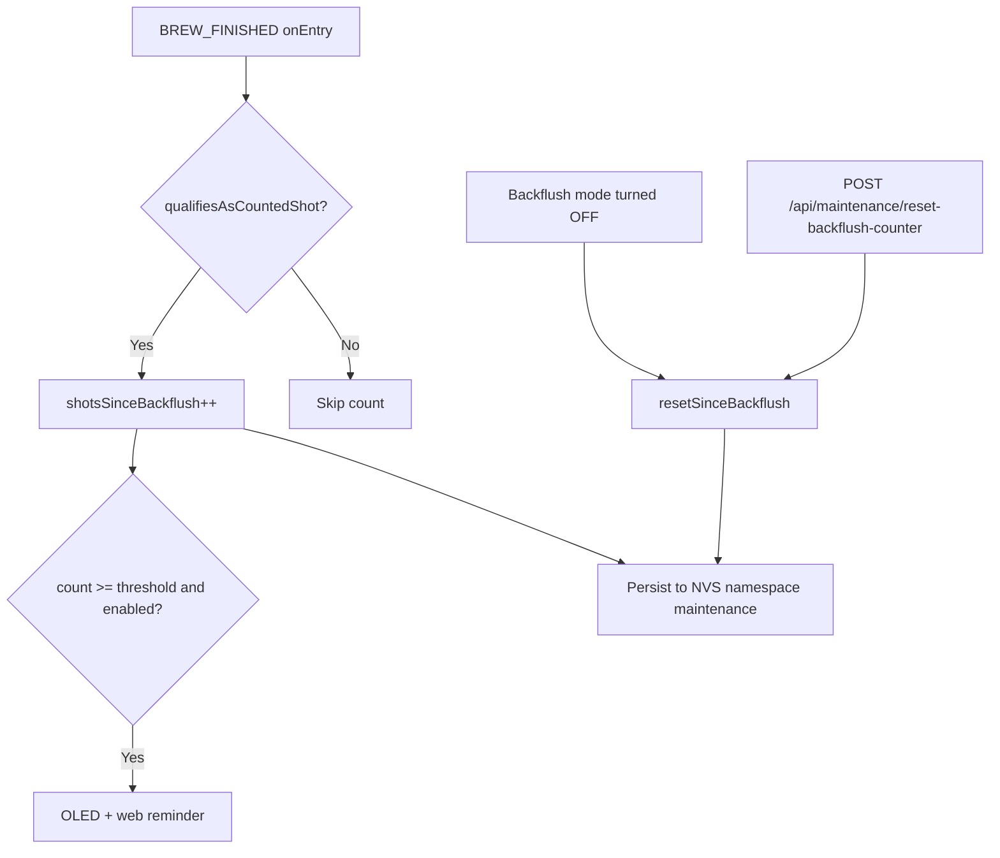

# Backflush Reminder / Shot Counter

**Status:** Implemented (v1)  
**Last updated:** 2026-05-20  
**Related config:** Maintenance section (`/config/behavior` → Maintenance)

---

## Idea

Home espresso machines need periodic backflushing (especially detergent backflushes) to keep the group head and 3-way valve clean. It is easy to forget when brewing daily.

This feature **passively tracks counted brews since the last backflush** and **reminds the user** on the OLED display and web UI when a configurable threshold is reached. It is **advisory only** — it never blocks brewing or forces a backflush.

**Typical usage pattern this targets:**

- Machine powered on daily
- ~2 espressos per session
- Machine powered off afterward
- Default threshold **50 shots** ≈ one reminder per month at that rate

---

## Architecture overview



### Components

| Layer | Responsibility |
|-------|----------------|
| [`BackflushReminderLogic.h`](../../include/clevercoffee/maintenance/BackflushReminderLogic.h) | Pure qualification + due-check helpers (unit-tested) |
| [`MaintenanceCoordinator`](../../include/clevercoffee/coordinators/MaintenanceCoordinator.h) | Counter in RAM, NVS persistence, reminder state |
| [`Config`](../../include/clevercoffee/Config.h) | `maintenance.backflush_reminder.enabled` / `.threshold` |
| [`BrewFinishedState`](../../src/state/states/BrewStates.cpp) | Hook: record brew after cycle completes |
| [`SystemContext::setBackflushMode`](../../src/context/SystemContext.cpp) | Auto-reset counter when backflush mode OFF |
| Web / MQTT / OLED | Status, notifications, HA discovery |

### What counts as one shot?

At **`BREW_FINISHED` entry** (not mid-brew):

Count **unless** `brewTime < 5s` **and** (scale disabled **or** `brewWeight < 10g`).

- Filters accidental switch taps
- Brews aborted in preinfusion/pause do **not** reach `BREW_FINISHED` → not counted (by design)

### Persistence

| Item | Storage |
|------|---------|
| Shot counter | NVS namespace `"maintenance"`, key `shots_since_bf` |
| Threshold / enabled | Normal config NVS via `ParamDef` |

- Write counter to NVS on **every counted shot** (safe at ~2/day; ~730 writes/year)
- Counter is **not** a `ParamDef` → survives config import/export without being wiped

### Reset semantics

| Action | Resets counter? |
|--------|-----------------|
| Backflush mode toggled **OFF** (web, MQTT, UI) | Yes |
| `POST /api/maintenance/reset-backflush-counter` | Yes |
| Single backflush fill/flush cycle (`BACKFLUSH_FINISHED`) | **No** (one cycle ≠ full cleaning session) |
| Aborted backflush → `BACKFLUSH_IDLE` | No |

---

## Configuration

| Parameter | Default | Description |
|-----------|---------|-------------|
| `maintenance.backflush_reminder.enabled` | `true` | Master toggle for notifications |
| `maintenance.backflush_reminder.threshold` | `50` | Shots before reminder |

**When disabled:** counting continues; only notifications are suppressed.

**Guidance for threshold:**

- **50** — ~monthly detergent reminder at 2 shots/day
- **10–25** — more frequent water-backflush reminders
- User-adjustable 1–500 in UI

---

## User-facing behavior

### OLED

- Status bar **`CLEAN`** when reminder is due
- Standard layout: footer line with backflush hint when due
- Upright layout: main status shows **`CLEAN`** when due
- No shot counter on OLED; no indicator while count is below threshold
- Localized strings (EN / DE / ES) in [`languages.h`](../../include/clevercoffee/display/languages.h)

### Web UI

- **[`MachineStatusToasts`](../../ui/packages/frontend/src/components/MachineStatusToasts.tsx)** — bottom-right Sonner toasts for standby and backflush due (session dismiss)
- **[`HomeMaintenanceCard`](../../ui/packages/frontend/src/components/HomeMaintenanceCard.tsx)** — home page shot counter, progress bar, and clean-due alert
- **[`HomeStandbyAlert`](../../ui/packages/frontend/src/components/HomeStandbyAlert.tsx)** — home page standby banner with wake action
- **Config → Behavior → Maintenance** — live `X / threshold` counter + **Reset counter** button ([`MaintenanceBackflushPanel`](../../ui/packages/frontend/src/components/MaintenanceBackflushPanel.tsx))

### API

**`GET /api/status`** (additional fields):

```json
{
  "shotsSinceBackflush": 47,
  "backflushReminderThreshold": 50,
  "backflushReminderDue": false
}
```

**`POST /api/maintenance/reset-backflush-counter`**

### MQTT / Home Assistant

- Sensors: `shotsSinceBackflush`, `backflushReminderDue`
- Config params: `backflushReminderEnabled`, `backflushReminderThreshold`
- HA discovery entries published for both sensors

---

## Implemented (v1)

- [x] `MaintenanceCoordinator` with per-shot NVS persistence
- [x] `qualifiesAsCountedShot()` qualification logic
- [x] Config parameters (default threshold 50)
- [x] Brew finished hook
- [x] Reset on backflush mode OFF + manual API reset
- [x] `/api/status` extension + OpenAPI update
- [x] OLED shot counter + CLEAN indicator + footer hint + i18n
- [x] Web notification + maintenance panel
- [x] MQTT sensors, config registration, HA discovery
- [x] Mock server support
- [x] Unit tests (`test/test_maintenance_coordinator/`, 10 cases)
- [x] `enabled=false` still counts, suppresses notifications
- [x] Reminder due recalculated live from config + counter (no stale announcement state)

---

## Possible next steps

Prioritized by likely value vs. effort.

### High value

| Idea | Rationale |
|------|-----------|
| **Multi-cycle backflush loop** | `backflush.cycles` exists in config but state machine runs one fill/flush today. Implement loop + optional reset when `cycleCount >= backflush.cycles` instead of (or in addition to) mode-OFF reset. |
| **Snooze (“remind in N days”)** | Extra NVS key; user dismisses reminder for a period without resetting counter or lying about maintenance. |
| **Separate water vs. detergent thresholds** | Industry often suggests ~10 shots for water backflush vs. monthly detergent. Two counters or two thresholds. |

### Medium value

| Idea | Rationale |
|------|-----------|
| **`lifetimeShots` counter** | Never-reset total for stats/MQTT; same batched or per-event NVS pattern. |
| **Home page backflush shortcut** | Notification “Home” link could deep-link to backflush toggle instead of `/`. |
| **Shared status in frontend context** | Avoid duplicate `/api/status` polling from notification + maintenance panel. |
| **Zod/types for status fields** | Add `shotsSinceBackflush`, `backflushReminderDue` to shared API schema. |

### Lower priority / product decisions

| Idea | Notes |
|------|-------|
| Count preinfusion aborts as partial shots | Would need routing brew-stop through `BREW_FINISHED` or separate counter logic |
| Block brew when overdue | Rejected for v1 — safety/UX risk |
| NVS write batching | Unnecessary at typical home duty cycles; adds power-loss risk for daily power-off users |
| Migration for existing users on upgrade | Today counter starts at 0 (full runway); document or offer “start counting from now” UX |

---

## Testing

```bash
# Unit tests
~/.platformio/penv/bin/pio test -e native_test -f test_maintenance_coordinator

# Firmware build
~/.platformio/penv/bin/pio run -e esp32_usb -s
```

**Manual smoke test checklist:**

1. Brew 2 real shots → counter increments in `/api/status` and maintenance panel
2. Short accidental brew (&lt;5s) → no increment
3. Set threshold low (e.g. 2) → OLED `CLEAN` + count, web toast + home card alert
4. Toggle backflush OFF → counter resets
5. Manual reset button → counter clears
6. Disable reminder → counter still increments; no OLED/web reminders

---

## File index (implementation)

| Area | Files |
|------|-------|
| Core logic | `include/clevercoffee/maintenance/BackflushReminderLogic.h` |
| Coordinator | `include/clevercoffee/coordinators/MaintenanceCoordinator.h`, `src/coordinators/MaintenanceCoordinator.cpp` |
| Defaults | `include/clevercoffee/defaults.h` |
| Brew hook | `src/state/states/BrewStates.cpp` |
| Reset path | `src/context/SystemContext.cpp` |
| API | `src/network/WebServerManager.cpp` |
| MQTT | `src/network/MQTTManager.cpp`, `src/core/SystemInitializer.cpp` |
| Display | `include/clevercoffee/display/displayCommon.h`, `languages.h`, `ModernDisplayTemplate.h` |
| Web UI | `ui/packages/frontend/src/components/MachineStatusToasts.tsx`, `HomeMaintenanceCard.tsx`, `HomeStandbyAlert.tsx`, `MaintenanceBackflushPanel.tsx`, `ConfigPage.tsx` |
| Tests | `test/test_maintenance_coordinator/test_main.cpp` |
