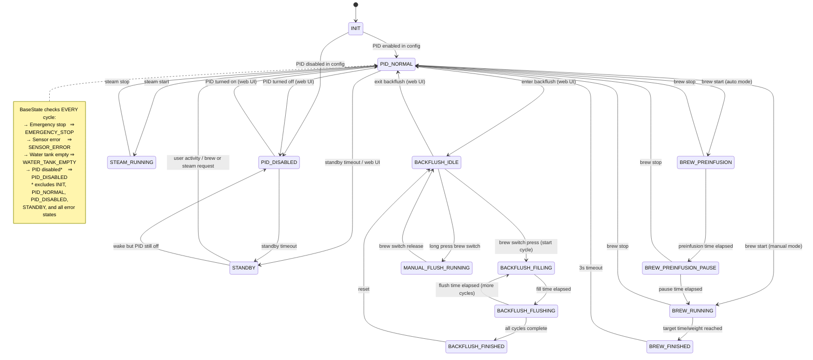
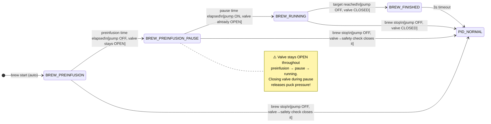
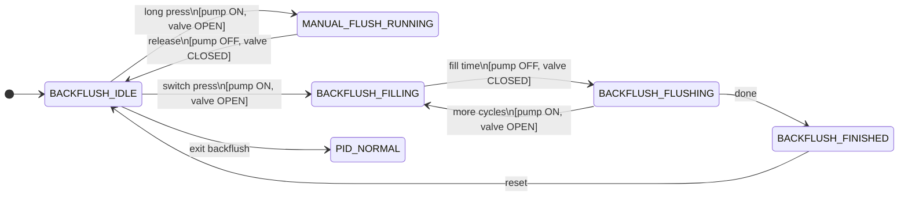
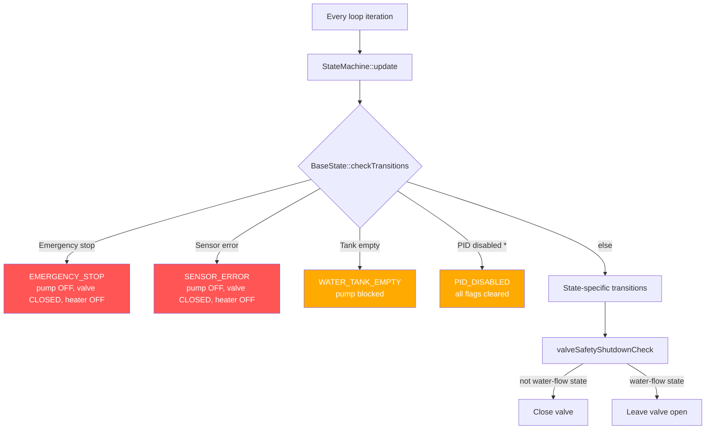

# State Machine Architecture & Hardware Control

Complete reference for the state machine, all transitions, and hardware (pump, valve, heater) behavior.

## How the State Machine Runs

Each state is a class inheriting from `BaseState<StateId, DerivedState>`. Every main-loop iteration:

```
StateMachine::update()
  ├── currentState->update(context)          ← periodic logic
  ├── currentState->checkTransitions(context) ← check if transition needed
  │     ├── BaseState safety checks (emergency / sensor / tank / PID)
  │     └── State-specific transition checks
  └── if transition needed:
        ├── oldState->onExit(context)
        ├── create new state
        └── newState->onEntry(context)

→ valveSafetyShutdownCheck()                 ← closes valve if not in water-flow state
→ display update
```

---

## Full State Diagram



---

## Brew Cycle Detail



---

## Backflush Cycle Detail



---

## Hardware State per State

| State | Pump | Valve | Heater (PID) | Notes |
|---|---|---|---|---|
| INIT | OFF | CLOSED | OFF | Boot-up |
| PID_NORMAL | OFF † | CLOSED | ACTIVE | † ON only when hot-water switch held |
| PID_DISABLED | OFF | CLOSED | OFF | All operations blocked, flags drained |
| STANDBY | OFF | CLOSED | OFF | Power-saving |
| BREW_PREINFUSION | **ON** | **OPEN** | ACTIVE | Water through puck |
| BREW_PREINFUSION_PAUSE | OFF | **OPEN** | ACTIVE | Bloom — pressure held |
| BREW_RUNNING | **ON** | **OPEN** | ACTIVE | Main extraction |
| BREW_FINISHED | OFF | CLOSED | ACTIVE | 3s result display |
| STEAM_RUNNING | OFF † | CLOSED | ACTIVE (steam setpoint) | † ON only when injection switch held |
| MANUAL_FLUSH_RUNNING | **ON** | **OPEN** | ACTIVE | Continuous flush |
| BACKFLUSH_IDLE | OFF | CLOSED | ACTIVE | Awaiting cycle |
| BACKFLUSH_FILLING | **ON** | **OPEN** | ACTIVE | Fill portafilter |
| BACKFLUSH_FLUSHING | OFF | CLOSED | ACTIVE | Drain to drip tray |
| BACKFLUSH_FINISHED | OFF | CLOSED | ACTIVE | All cycles done |
| WATER_TANK_EMPTY | OFF | CLOSED | OFF‡ | Pump blocked by HardwareManager; ‡ ACTIVE if `hardware.sensors.watertank.keep_heater_on_empty` is set. Standby request and standby timeout still transition to STANDBY (heater off) so the heater never runs unattended indefinitely; an empty tank does not wake a machine already in STANDBY |
| EMERGENCY_STOP | OFF | CLOSED | OFF | Full shutdown |
| SENSOR_ERROR | OFF | CLOSED | OFF | Safe mode |
| EEPROM_ERROR | OFF | CLOSED | OFF | Safe mode |

---

## Brew Stop — Valve Closure

> **The valve must stay energized throughout the entire preinfusion → pause → running sequence.** Closing it early releases puck pressure and ruins the shot.

| Stopped from | Who closes the valve | When |
|---|---|---|
| BREW_PREINFUSION | `valveSafetyShutdownCheck()` | Same loop iteration, after state machine update |
| BREW_PREINFUSION_PAUSE | `valveSafetyShutdownCheck()` | Same loop iteration, after state machine update |
| BREW_RUNNING | `BrewRunningState::onExitImpl` | Immediately on transition |

**Sequence when stopping from preinfusion or pause:**
1. State transitions to `PID_NORMAL`
2. `onExitImpl` disables pump — valve stays open
3. `valveSafetyShutdownCheck()` runs (same loop, after state machine)
4. Safety check: not in water-flow state → closes valve

---

## Safety Layers



> \* PID disable check excludes: `INIT`, `PID_NORMAL`, `PID_DISABLED`, `STANDBY`, and all error states.

**Water-flow states** (valve allowed open): `BREW_PREINFUSION`, `BREW_PREINFUSION_PAUSE`, `BREW_RUNNING`, `MANUAL_FLUSH_RUNNING`, `BACKFLUSH_FILLING`, `BACKFLUSH_FLUSHING`.

### HardwareManager guards (Layer 4)
- `enablePump()` refuses if tank empty or emergency mode active
- `setWaterTankEmpty()` force-disables pump when tank empties mid-brew (pushed after `SensorCoordinator::update()`, before state machine and process control in `LoopManager`)
- `emergencyShutdown()` kills pump, valve, and heater immediately

---

## Flag Lifecycle

| Flag | Set by | Consumed by | Standby behavior |
|---|---|---|---|
| `brewStartRequested` | BrewHandler (switch press) | PidNormalState, BrewFinishedState, StandbyState | **Preserved** (wake trigger) |
| `brewStopRequested` | BrewHandler (switch release) | Brew states | Cleared |
| `steamStartRequested` | SteamHandler (switch press) | PidNormalState, StandbyState | **Preserved** (wake trigger) |
| `steamStopRequested` | SteamHandler (switch release) | SteamRunningState | Cleared |
| `manualFlushStartRequested` | BrewHandler (long press in backflush) | PidNormalState, BackflushIdleState | Cleared |
| `manualFlushStopRequested` | BrewHandler (release during flush) | ManualFlushRunningState | Cleared |
| `backflushEnterRequested` | Web UI / MQTT | PidNormalState | Cleared |
| `backflushCycleStartRequested` | BrewHandler (press in backflush idle) | BackflushIdleState, BackflushFinishedState | Cleared |
| `backflushStopRequested` | BrewHandler (press during cycle) | BackflushFillingState, BackflushFlushingState | Cleared |
| `normalOperationRequested` | Web UI | StandbyState | Cleared |
| `standbyRequested` | Web UI | PidNormalState | Cleared |

### Drain rules

| State | What gets cleared | Why |
|---|---|---|
| `PidDisabledState` (entry + update) | **All** flags | Prevent stale flags from triggering operations on re-enable |
| `StandbyState` (entry) | Stop flags only | Preserve brew/steam start as wake triggers |
| All other states | The one flag they act on | Normal consumption |

### Helper methods

```cpp
// Drain all flags — use in PID_DISABLED and error states
void MachineStateContext::clearAllActionRequests() noexcept;

// Drain stop flags only — use in STANDBY (preserves wake triggers)
void MachineStateContext::clearStaleStopRequests() noexcept;
```
